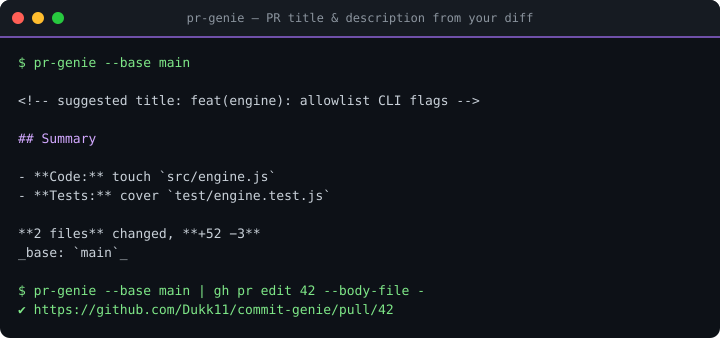

# 🧞 pr-genie

[](https://github.com/Dukk11/pr-genie/actions/workflows/ci.yml)
[](https://www.npmjs.com/package/pr-genie)
[](LICENSE)
[](package.json)


<p align="center"></p>

**Stop writing PR boilerplate.** pr-genie reads your diff, groups every file by
area, and auto-writes the PR title and a complete Markdown description —
summary, stats, commit list, review checklist. Works offline in milliseconds,
with an optional one-command polish pass through your **local Ollama** models.

```console
$ pr-genie --base main
<!-- suggested title: feat(engine): allowlist CLI flags -->
## Summary

- **Code:** touch `src/engine.js`
- **Tests:** cover `test/engine.test.js`

**2 files** changed, **+52 −3**
_base: `main`_
...
```

## Why

You already wrote the commits. Your diff already says what changed. Copying
that into a PR form is robot work — so let the robot do it. pr-genie is
**zero-dependency** (one auditable folder, ~15 KB), runs in milliseconds, and
never sends a single byte anywhere unless *you* ask for the Ollama polish —
which still stays on `127.0.0.1`.

## Install

```console
npm install -g pr-genie      # or just: npx pr-genie
```

Requires Node ≥ 18 and `git`. **0 npm dependencies.**

## Usage

```console
pr-genie                       # summarize staged changes (git diff --cached)
pr-genie --base main           # summarize the whole branch vs. main
pr-genie --ai                  # + polish pass via local Ollama (llama3.2)
pr-genie --ai mistral          # pick any model you have pulled
pr-genie --title-only          # just the suggested title (for gh pr create)
```

**Straight into the GitHub CLI:**

```console
pr-genie --base main | gh pr edit 42 --body-file -
pr-genie --title-only          # → gh pr create --title "$(…)"
```

## As a GitHub Action

```yaml
name: PR description
on:
  pull_request:
    types: [opened]

jobs:
  describe:
    runs-on: ubuntu-latest
    permissions:
      pull-requests: write
      contents: read
    steps:
      - uses: actions/checkout@v4
        with:
          fetch-depth: 0
      - uses: Dukk11/pr-genie@main
        with:
          base: main
```

## How it works

1. `git diff --numstat` (staged) or `git diff <base>...HEAD --numstat` (branch mode).
2. Files are bucketed by area — Code, Tests, Docs, CI, Config, Dependencies.
3. Conventional-Commit subjects drive the title; the body is assembled deterministically.
4. Optional: the draft is sent to **your local Ollama** (`http://127.0.0.1:11434`,
   hardcoded loopback — no remote endpoints, ever) for a wording pass.

**Security posture:** refs are validated against a strict pattern and verified
via `rev-parse` before use; nothing is ever passed to a shell; the AI endpoint
is a compile-time loopback literal.

## Contributing

PRs welcome — see [CONTRIBUTING.md](CONTRIBUTING.md). Hard rule: **zero runtime
dependencies**, tests via `node:test`.

## More from Duk · [dukdev.com](https://dukdev.com)

| | |
|---|---|
| [commit-genie](https://github.com/Dukk11/commit-genie) | AI commit messages — free via Ollama, offline mode |
| [standup-genie](https://github.com/Dukk11/standup-genie) | Your standup, written by your commits |
| [changelog-genie](https://github.com/Dukk11/changelog-genie) | Conventional commits → CHANGELOG + Release, automated |
| [repo-autopilot](https://github.com/Dukk11/repo-autopilot) | Rule-based issue/PR triage as a GitHub Action |
| [linkrot-guard](https://github.com/Dukk11/linkrot-guard) | Dead-link guardian for your READMEs, on a schedule |
| [devtoolbelt](https://dukk11.github.io/devtoolbelt) | 18 dev tools, 100 % client-side |

## License

[MIT](LICENSE) · built by **Duk** · [dukdev.com](https://dukdev.com)
